# 在线生成音频 PRD（独立摘录版）

## 0. 文档定位

本文档从原始 Feishu PRD《音频语料生成平台 PRD（一期）V1.3》里，单独抽取并重写了“在线生成音频”相关内容，目标是让 GPT 在**不再依赖原始大 PRD** 的前提下，能够完整理解并用于后续 `demo_app` 的定向改造。

- 原始需求来源：[音频语料生成平台 PRD（一期）V1.3](https://nicebuild.feishu.cn/wiki/AsHnw8x94i0DrAkEJ6TcA42JnWx)
- 抽取日期：2026-03-25
- 当前用途：仅用于“在线生成音频”模块的产品理解、界面还原、交互实现、校验实现和任务流实现
- 当前任务范围：本次只产出文档，不改动 demo 代码

## 1. 适用范围

本文档覆盖以下内容：

- 在线生成音频入口与弹窗结构
- 两种生成模式及切换逻辑
- LLM 生成模式字段定义
- 直接输入文本模式字段定义
- 文本预览与编辑规则
- 说话人数与音色配置规则
- 提交生成任务、任务状态、超时机制
- 输出文件、落库字段、错误处理、非功能约束
- 原型视觉参考与截图

本文档不覆盖以下内容：

- 注册登录
- 上传文件
- 全局搜索
- 我的音频 / 文件管理 / 回收站
- 音频详情页的完整设计

## 2. 规则优先级

后续如果 GPT 需要基于本文档改造 demo，请按以下优先级理解需求：

1. 本文档中的明确业务规则，优先级最高。
2. 本文档中引用的原始 PRD 业务约束，优先于原型的简化实现。
3. 原型和截图主要用于确定 UI 结构、视觉分段、字段摆放顺序、交互节奏。
4. 当原始 PRD 和原型存在冲突时，以“业务规则优先、原型视觉参考其次”为原则，具体冲突见本文最后一节。

## 3. 模块目标

“在线生成音频”模块的目标是：让用户通过一个弹窗完成文本来源选择、文本生成或输入、说话人与音色配置，并最终提交音频生成任务，生成音频文件以及可选的脚本文件。

这个模块不是独立页面，而是站内主流程入口之一。

## 4. 核心用户流程

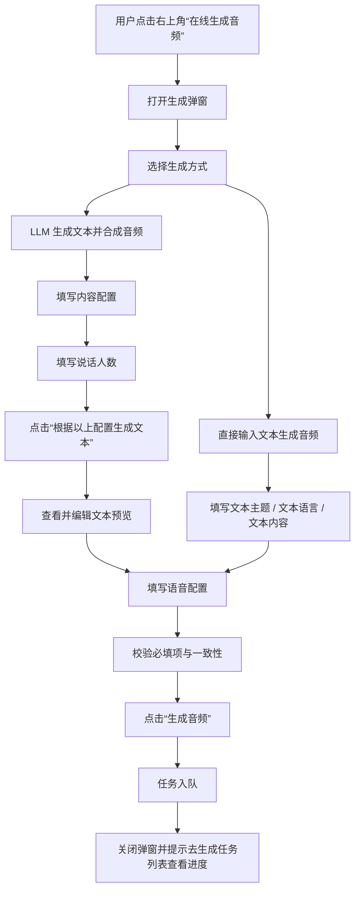

## 5. 入口与载体

### 5.1 入口

- 用户点击页面右上角按钮“在线生成音频”。
- 系统弹出生成窗口。

### 5.2 载体形式

- 在线生成音频以弹窗形式出现。
- 弹窗底部固定两个动作按钮：“取消”和“生成音频”。
- 弹窗内容区内部可滚动。

## 6. 弹窗结构总览

在线生成音频弹窗由以下几个区域组成，按展示顺序排列：

1. 生成方式
2. 内容配置区或文本内容区
3. 说话人数区
4. 文本预览与编辑区
5. 语音配置区
6. 底部操作区

其中：

- “文本预览与编辑区”仅在 LLM 模式下生成文本后出现。
- “内容配置区”仅在 LLM 模式下显示。
- “文本内容区”仅在直接输入模式下显示。
- “语音配置区”在两种模式下都显示。

## 7. 生成方式

### 7.1 字段定义

| 字段 | 类型 | 必填 | 说明 |
|---|---|---:|---|
| 生成方式 | 单选 | 是 | 选择文本来源和生成路径 |

### 7.2 可选项

- `LLM 生成文本并合成音频`，默认选中
- `直接输入文本生成音频`

### 7.3 模式切换逻辑

当用户选择不同生成方式时，界面行为如下：

| 选择 | 页面变化 |
|---|---|
| LLM 生成文本并合成音频 | 显示“内容配置”区域，后续允许生成文本预览 |
| 直接输入文本生成音频 | 隐藏“内容配置”区域，仅显示“文本内容”输入区域 |

## 8. LLM 生成模式

### 8.1 适用场景

当用户希望系统先生成对话文本，再基于该文本合成音频时，使用该模式。

### 8.2 字段定义

| 字段 | 类型 | 必填 | 规则 |
|---|---|---:|---|
| 文本主题 | 输入框 | 是 | 描述对话主题，最长 255 字符 |
| 主题模板 | 下拉框 | 是 | 选择场景模板 |
| 自定义 Prompt | 多行输入 | 否 | 仅在主题模板为“自定义”时出现 |
| 关键词 | 标签输入 | 否 | 生成文本中应包含这些关键词 |
| 文本语言 | 下拉框 | 是 | 用于限定文本语言和后续音色筛选 |
| 目标对话时长 | 数字输入框 | 是 | 单位秒，最小值 10，最大值 43200 |

### 8.3 主题模板

系统预置以下模板：

| 模板名称 | 含义 |
|---|---|
| 会议讨论 | 多人会议讨论 |
| 访谈 | 主持人与嘉宾对话 |
| 问诊 | 医生与病人对话 |
| 自定义 | 用户自己写 Prompt |

补充规则：

- 预置模板的 Prompt 放在配置文件中，新增模板不应要求改动核心逻辑。
- 当用户选择“自定义”时，显示“自定义 Prompt”输入框。
- 用户可以通过自定义 Prompt 描述具体生成要求，例如“生成一个两人技术讨论，讨论软件发布流程，语气自然”。
- 由于生成逻辑依赖用户输入的 Prompt，系统生成文本可能不符合预期；允许用户改 Prompt 后重新生成。

### 8.4 支持语种

| 语言名称 | 语言代码 |
|---|---|
| 中文（普通话） | `zh` |
| 英语 | `en` |
| 日语 | `ja` |
| 韩语 | `ko` |
| 西班牙语 | `es` |
| 法语 | `fr` |
| 德语 | `de` |
| 葡萄牙语 | `pt` |
| 意大利语 | `it` |
| 俄语 | `ru` |
| 阿拉伯语 | `ar` |
| 印度尼西亚语 | `id` |

## 9. 文本预览与编辑

### 9.1 出现条件

- 仅在 LLM 模式下出现。
- 用户点击“根据以上配置生成文本”后出现。

### 9.2 用户能力

用户可以在文本预览区：

- 查看 LLM 生成的文本
- 手动修改文本内容
- 删除行内容
- 点击“重新生成”覆盖当前文本

### 9.3 文本格式规范

每一行都必须满足以下格式：

```text
Speaker N: 对话内容
```

规则如下：

- `N` 为数字，从 `1` 开始。
- Speaker 编号必须连续，不允许跳号。
- 文本中出现的 Speaker 数量必须与“说话人数”一致。

### 9.4 重新生成规则

- 点击“重新生成”后，当前文本会被覆盖。
- 系统应先弹窗确认，再执行重新生成。

## 10. 直接输入文本模式

### 10.1 适用场景

当用户已经有现成文本，希望直接合成音频时，使用该模式。

### 10.2 字段定义

| 字段 | 类型 | 必填 | 规则 |
|---|---|---:|---|
| 文本主题 | 输入框 | 是 | 最长 255 字符，用于文件命名和检索 |
| 文本内容 | 多行输入 | 是 | 需满足 `Speaker N: 对话内容` 的格式规范 |
| 文本语言 | 下拉框 | 是 | 与 LLM 模式共用同一套语种列表 |

### 10.3 模式规则

- 该模式不显示“内容配置”区域。
- 该模式不需要“生成文本”步骤。
- 该模式直接用用户输入的文本进入后续语音配置和任务提交。

## 11. 说话人数与语音配置

该配置区在两种模式下都必须显示。

### 11.1 共用字段定义

| 字段 | 类型 | 必填 | 规则 |
|---|---|---:|---|
| 说话人数 | 数字输入框 | 是 | 范围 1–10，且必须与文本中的 Speaker 数量一致 |
| 音色配置 | 映射选择 | 是 | 每个 Speaker 必须指定一个音色 |
| 精准时长控制 | 数字输入框 | 否 | TTS 合成目标时长，单位秒，允许误差 ±5% |
| 音频输出格式 | 下拉框 | 是 | 支持 `WAV / MP3 / M4A` |
| 输出脚本文件 | Checkbox | 否 | 勾选后输出 `JSON + SRT` |
| 保存到文件夹 | 下拉框 | 否 | 默认值为“默认目录” |
| 标签 Tag | 标签输入 | 否 | 支持多个标签，单个标签最长 50 字符 |

### 11.2 音色配置规则

- 系统预置音色列表。
- 每个音色包含：名称、性别标注、支持语言标注。
- 用户需要为每个 Speaker 独立选择一个音色。
- 映射关系是有序的。
- 示例：`Speaker 1 -> 音色 A`，`Speaker 2 -> 音色 B`。
- 同一 Speaker 的所有句子必须使用同一个音色。
- 音色与文本语言存在兼容性约束。
- 系统应只展示支持当前文本语言的音色。

### 11.3 说话人数校验

- 如果“说话人数”与文本中的实际 Speaker 数量不一致，点击“生成音频”时必须报错。
- 错误提示固定为：

```text
说话人数与文本中的 Speaker 数量不符，请检查后重试
```

- 系统不自动修改文本，也不自动修改说话人数。

### 11.4 必须拦截的未完成状态

- 如果用户未完成所有 Speaker 的音色指定，则不允许提交任务。
- PRD 的目标行为是：

```text
“生成音频”按钮置灰不可点击，并提示：请为所有说话人选择音色
```

## 12. 提交生成任务

### 12.1 提交时机

用户点击“生成音频”按钮后，系统应执行以下动作：

1. 校验所有必填参数
2. 校验格式与一致性
3. 校验通过后，将任务提交至任务队列
4. 关闭弹窗
5. Toast 提示：

```text
任务已提交，请在生成任务列表查看进度
```

### 12.2 防重复提交

- 点击“生成音频”后，按钮应立即禁用，防止重复提交。
- 同一用户同时进行中的生成任务不得超过 `3` 个。
- 超出上限时，提示：

```text
当前已有 3 个任务进行中，请等待任务完成后再提交
```

## 13. 输出结果与持久化字段

### 13.1 生成完成后的音频文件命名

音频文件名规则：

```text
{文本主题}_{yyyyMMddHHmmss}.{格式}
```

示例：

```text
会议讨论_20240315143022.mp3
```

### 13.2 生成完成后需要落库的字段

| 字段 | 说明 |
|---|---|
| 文件名 | 按 `{文本主题}_{yyyyMMddHHmmss}.{格式}` 生成 |
| 音频时长 | 实际生成音频的时长，单位秒 |
| 来源 | 固定值：`生成` |
| 文件大小 | 自动计算 |
| 创建时间 | 音频生成完成时间 |
| 语言 | 用户所选语言 |
| 人数 | 用户所选说话人数 |
| 场景 | 主题模板名称；若为自定义模板则记录“自定义” |
| 文本主题 | 用户填写的文本主题 |
| 所在文件夹 | 用户选择的目标文件夹；默认“默认目录” |
| 标签 | 用户填写的标签 |

### 13.3 场景与来源的枚举约定

场景 `scene` 推荐映射如下：

| 展示值 | 枚举值 |
|---|---|
| 会议讨论 | `meeting` |
| 访谈 | `interview` |
| 问诊 | `medical` |
| 自定义 | `custom` |

来源 `source` 的枚举值：

| 展示值 | 枚举值 |
|---|---|
| 在线生成 | `generated` |
| 用户上传 | `uploaded` |

### 13.4 脚本文件输出

如果用户勾选“输出脚本文件”，则与音频文件同目录生成：

```text
{文件名}.mp3（或对应格式）
{文件名}_transcript.json
{文件名}_transcript.srt
```

### 13.5 JSON 文件结构示例

```json
{
  "audio_id": "audio_001",
  "duration": 60.12,
  "language": "zh",
  "speaker_count": 2,
  "segments": [
    {
      "segment_id": 1,
      "speaker_id": "S1",
      "start_time": 0.0,
      "end_time": 4.12,
      "text": "你好"
    },
    {
      "segment_id": 2,
      "speaker_id": "S2",
      "start_time": 4.5,
      "end_time": 8.3,
      "text": "你好，今天我们讨论什么话题？"
    }
  ]
}
```

### 13.6 SRT 文件结构示例

```text
1
00:00:00,000 --> 00:00:04,120
S1: 你好

2
00:00:04,500 --> 00:00:08,300
S2: 你好，今天我们讨论什么话题？
```

## 14. 任务状态与超时机制

### 14.1 任务列表中需要展示的信息

| 字段 | 说明 |
|---|---|
| 任务 ID | 任务编号 |
| 生成方式 | `LLM 生成` / `直接输入` |
| 文本主题 | 本次生成的主题 |
| 人数 | Speaker 数量 |
| 语言 | 音频语言 |
| 提交时间 | 任务创建时间 |
| 完成时间 | 任务完成时间；进行中时为空 |
| 任务状态 | 当前状态 |

### 14.2 任务状态

| 状态 | 说明 | 颜色建议 |
|---|---|---|
| 排队中 | 任务已入队，等待调度 | 灰色 |
| 文本生成中 | 正在调用 LLM 生成文本，仅 LLM 模式会出现 | 蓝色 |
| 语音合成中 | 正在调用 TTS 引擎合成音频 | 蓝色 |
| 生成成功 | 音频已生成完成 | 绿色 |
| 生成失败 | 生成过程中出错 | 红色 |

### 14.3 超时机制

| 阶段 | 超时时间 | 超时后行为 |
|---|---:|---|
| 排队超时 | 30 分钟 | 标记失败，提示“任务排队超时，请重新提交” |
| 文本生成超时 | 60 秒 | 自动重试 1 次，仍失败则标记失败，提示“文本生成超时” |
| 语音合成超时 | 10 分钟 | 标记失败，提示“语音合成超时” |
| 整体任务超时 | 15 分钟 | 强制终止任务并释放资源 |

### 14.4 任务操作

| 操作 | 可用状态 | 说明 |
|---|---|---|
| 查看结果 | 生成成功 | 跳转到生成的音频详情页 |
| 取消任务 | 排队中 / 文本生成中 / 语音合成中 | 中止当前任务 |
| 重新生成 | 生成失败 | 使用原参数再次提交 |
| 删除任务 | 所有状态 | 删除任务记录，不影响已生成的音频文件 |

## 15. 校验矩阵

下面是 GPT 在实现 demo 时必须理解并覆盖的关键校验点。

| 校验项 | 触发时机 | 结果 |
|---|---|---|
| 生成方式未选择 | 提交前 | 不允许提交 |
| 文本主题为空 | LLM 模式生成文本前、提交前 | 不允许继续 |
| 主题模板为空 | LLM 模式提交前 | 不允许提交 |
| 选择“自定义”但 Prompt 为空 | LLM 模式提交前 | 建议视为不合法 |
| 文本语言为空 | 提交前 | 不允许提交 |
| 目标对话时长为空 | LLM 模式提交前 | 不允许提交 |
| 目标对话时长不在 `10-43200` | LLM 模式提交前 | 不允许提交 |
| 文本内容为空 | 直接输入模式提交前 | 不允许提交 |
| 文本格式不满足 `Speaker N: 内容` | 提交前 | 不允许提交 |
| Speaker 编号不连续 | 提交前 | 不允许提交 |
| 说话人数不在 `1-10` | 提交前 | 不允许提交 |
| 说话人数与文本中的 Speaker 数量不一致 | 提交前 | 报错并阻止提交 |
| 任一 Speaker 未选择音色 | 提交前 | 阻止提交 |
| 音色与语言不兼容 | 提交前 | 阻止提交 |
| 输出格式为空 | 提交前 | 不允许提交 |
| 同用户进行中的任务数大于 3 | 提交前 | 阻止提交 |

## 16. 错误处理

### 16.1 LLM 相关错误

| 错误场景 | 用户提示 | 系统行为 |
|---|---|---|
| LLM API 超时（> 60 秒） | 文本生成超时，请重试 | 自动重试 1 次，仍失败则标记任务失败 |
| LLM 返回内容不含 Speaker 标签 | 生成内容格式有误，请重试或换一个主题 | 自动重试 1 次 |
| LLM 触发内容安全拦截 | 该主题无法生成，请修改主题后重试 | 标记失败，不重试 |
| LLM 返回空内容 | 文本生成失败，请重试 | 自动重试 1 次 |

### 16.2 TTS 相关错误

| 错误场景 | 用户提示 | 系统行为 |
|---|---|---|
| TTS 合成失败 | 语音合成失败，请重试 | 整体任务失败，不支持部分成功 |
| 所选音色不支持所选语言 | 所选音色不支持该语言，请更换音色 | 前端校验拦截，不提交任务 |
| TTS 合成超时 | 语音合成超时，请重试 | 标记任务失败 |

### 16.3 通用错误

| 错误场景 | 用户提示 |
|---|---|
| 网络异常 | 网络连接失败，请检查网络后刷新重试 |
| 服务端 500 错误 | 系统异常，请稍后重试。如持续出现，请联系管理员 |
| 登录态过期 | 登录已过期，请重新登录，并跳转登录页 |

## 17. 非功能约束

### 17.1 性能要求

| 指标 | 目标值 |
|---|---|
| 音频生成（目标时长 ≤ 60 秒） | 任务完成时间 ≤ 90 秒 |
| 音频生成（目标时长 > 60 秒） | 任务完成时间 ≤ 目标时长 × 1.5 |
| 页面首屏加载 | ≤ 3 秒 |

### 17.2 并发限制

| 限制项 | 限制值 |
|---|---|
| 单用户同时进行中的生成任务 | ≤ 3 个 |
| 全平台并发生成任务总数 | ≤ 50 个，超出后排队 |

### 17.3 浏览器兼容性

| 浏览器 | 最低支持版本 |
|---|---|
| Chrome | 90+ |
| Firefox | 88+ |
| Safari | 14+ |
| Edge | 90+ |

不支持 IE。

## 18. 原型默认值与视觉参考

说明：

- 本节配图基于本地原型 `音频语料生成平台_原型.html` 复现。
- 由于聊天附件无法直接写入仓库文件，以下图片为**按你上传截图的相同状态重新抓取的等价图**。
- 对于 demo 改造，图片主要用于确定布局、字段顺序、分区标题和交互节奏。

### 18.1 LLM 模式默认态

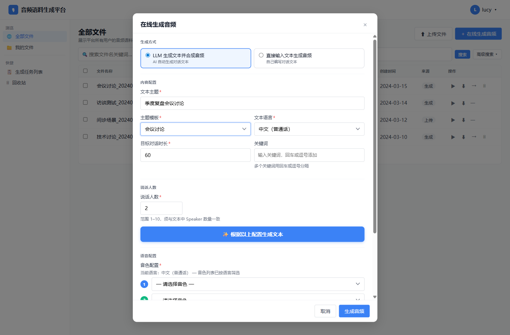

关键信息：

- 顶部标题为“在线生成音频”
- 默认选中“LLM 生成文本并合成音频”
- 内容配置区位于说话人数区之前
- 底部固定“取消”和“生成音频”

### 18.2 主题模板选项展开态

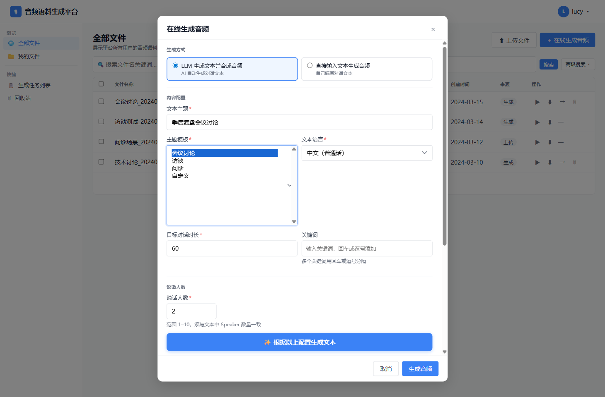

关键信息：

- 下拉项至少包含：会议讨论、访谈、问诊、自定义
- 自定义用于触发自定义 Prompt 输入区

### 18.3 文本语言选项展开态

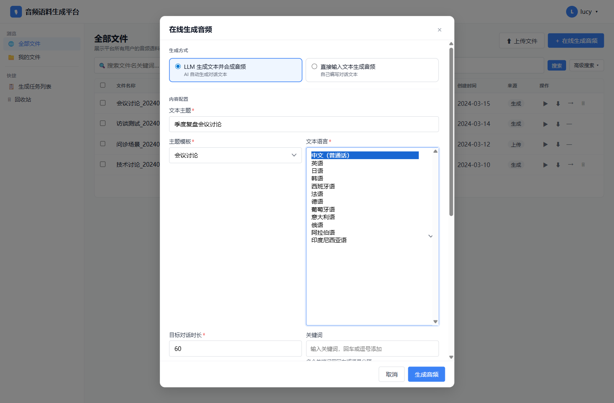

关键信息：

- 展示完整 12 种语言
- 该字段会驱动后续音色过滤

### 18.4 说话人数与生成文本按钮

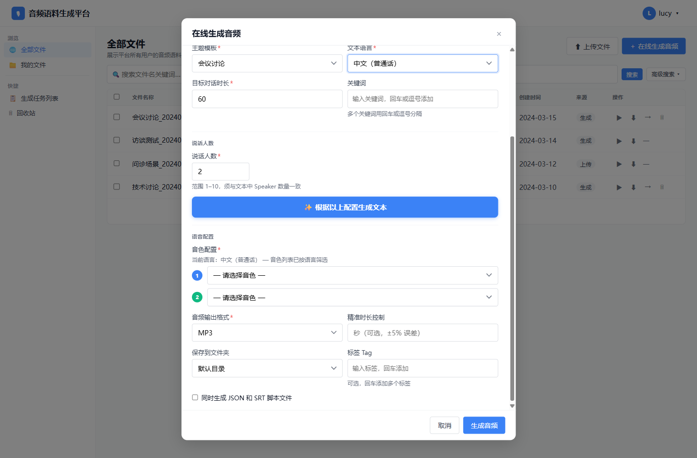

关键信息：

- 说话人数在内容配置之后
- “根据以上配置生成文本”是 LLM 模式里的关键动作按钮

### 18.5 语音配置默认态


关键信息：

- 先展示“当前语言”提示
- 再展示逐个 Speaker 的音色选择器
- 输出格式、精准时长、保存文件夹、标签、脚本输出都在同一区域

### 18.6 Speaker 1 音色列表展开态

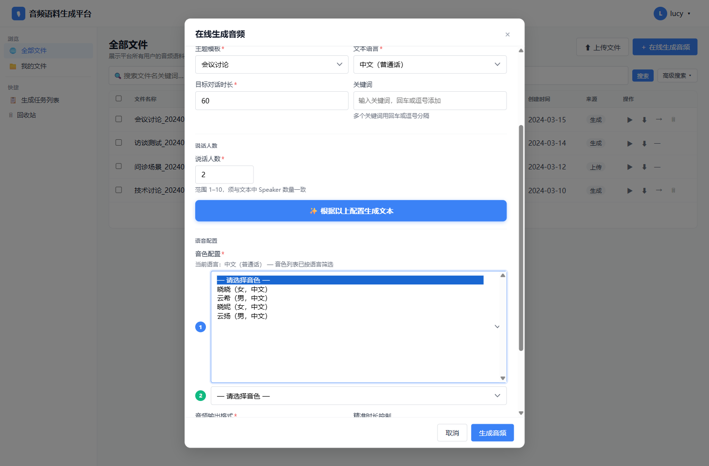

关键信息：

- 每个 Speaker 单独选音色
- 音色列表应体现语言兼容性

### 18.7 Speaker 2 音色列表展开态

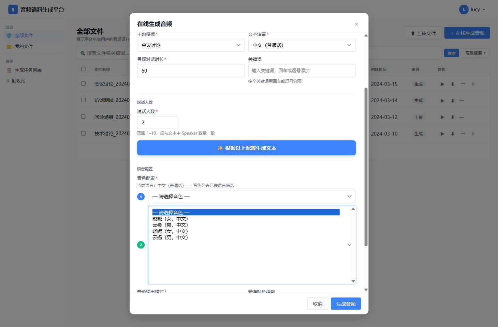

关键信息：

- Speaker 2 的选择器行为应与 Speaker 1 一致
- 多个 Speaker 的音色映射需要独立保存

### 18.8 音频输出格式展开态

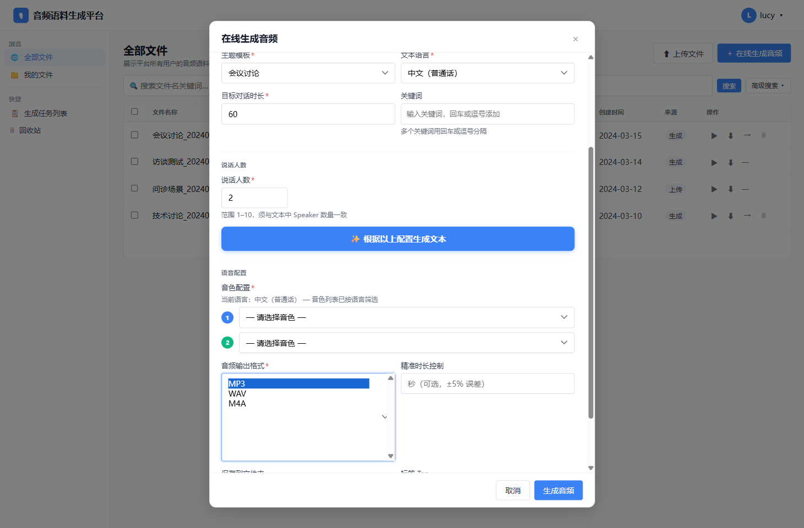

关键信息：

- 输出格式至少包含 `MP3 / WAV / M4A`

### 18.9 直接输入模式默认态

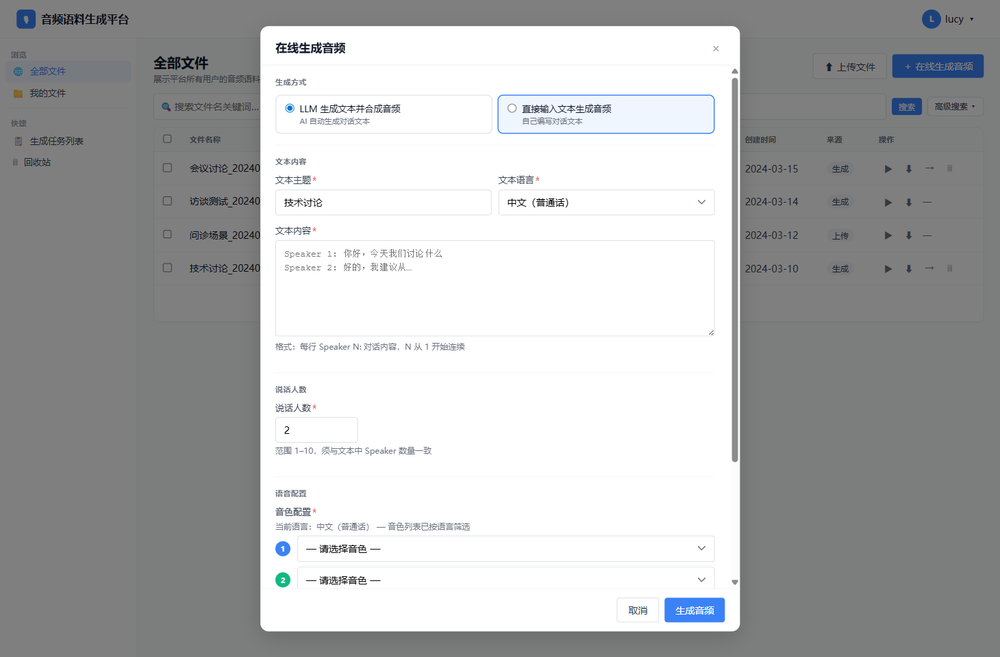

关键信息：

- 切到手动模式后，不再显示 LLM 内容配置
- 展示文本主题、文本语言、文本内容输入框

### 18.10 直接输入模式的语言下拉展开态

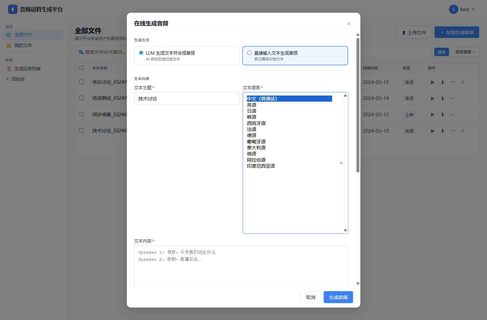

关键信息：

- 手动模式与 LLM 模式共用同一套语言列表

### 18.11 直接输入模式下的说话人数与语音配置

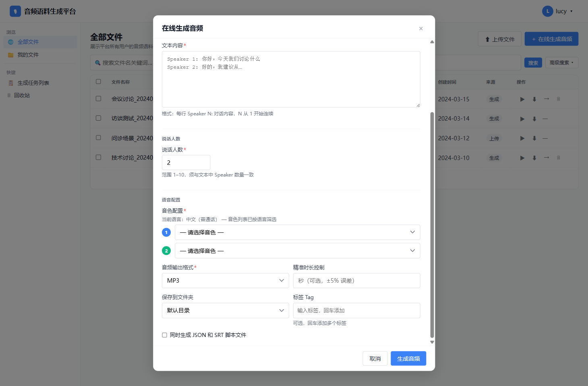

关键信息：

- 手动模式在文本内容之后仍然需要说话人数
- 说话人数之后仍然要进入语音配置区

## 19. 适合 GPT 执行的实现口径

如果后续让 GPT 直接改 demo，请把下面这些理解成“可直接执行的模块口径”：

- 这个模块是弹窗，不是新页面。
- 优先还原“顶部生成方式 + 中部内容配置/文本输入 + 下部说话人数 + 语音配置 + 底部操作区”的整体结构。
- LLM 模式与直接输入模式，共用同一套底部语音配置。
- “文本语言”是一个上游字段，它同时决定文本语种和音色候选范围。
- “说话人数”是连接文本和 TTS 的桥梁字段，必须和文本中的 Speaker 数量一致。
- 文本格式规范必须当成硬规则，不是展示建议。
- 提交动作不是立即生成结果，而是“提交任务到任务队列”。
- 成功提交后要关闭弹窗，并引导用户去任务列表查看进度。

## 20. 已知冲突与落地建议

以下是原始 PRD 与当前原型之间，后续改造时最需要注意的差异。

### 20.1 目标对话时长上限冲突

- 原始 PRD：最小 10 秒，最大 43200 秒（12 小时）
- 当前原型：输入框写的是 `10–3600`
- 落地建议：业务规则按 PRD 执行，即上限采用 `43200`

### 20.2 未选完音色时的交互冲突

- 原始 PRD：按钮应置灰不可点击，并提示“请为所有说话人选择音色”
- 当前原型：点击“生成音频”后才显示警告
- 落地建议：以 PRD 为准，实现前置禁用；可保留提示文案

### 20.3 语言与音色过滤冲突

- 原始 PRD：只展示支持当前文本语言的音色
- 当前原型：示例列表里仍能看到跨语言音色
- 落地建议：把原型视为示意数据，真正逻辑按 PRD 实现语言过滤

### 20.4 任务并发限制未在原型中完整体现

- 原始 PRD：同用户同时进行中任务不得超过 3 个
- 当前原型：只体现了提交流程，没有体现完整限制
- 落地建议：后续改造时把并发限制作为真正业务规则实现

### 20.5 Speaker 数量校验未在原型中完整体现

- 原始 PRD：提交时必须校验文本中的 Speaker 数量与“说话人数”一致
- 当前原型：已有提示文案，但校验逻辑较弱
- 落地建议：把这一条视为必须实现的硬校验

## 21. 给后续 GPT 的一句话指令模板

如果后续需要把这份文档直接交给 GPT 做 demo 改造，可以使用类似下面的任务口径：

```text
请严格按照 docs/online-audio-generation-prd.md 改造 demo_app 中的“在线生成音频”弹窗。以文档中的业务规则为准，以截图和原型结构为视觉参考，不要扩展到上传、搜索、文件管理等其他模块。
```
